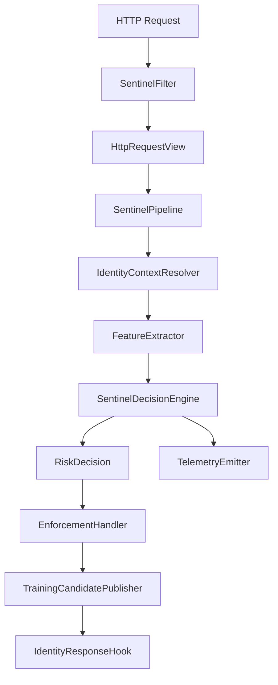

# AI-Sentinel — Architecture (as implemented)

This document describes the **current** runtime architecture of the AI-Sentinel Spring Boot starter and core library. It replaces earlier design-only notes (e.g. external ML libraries or modules that were never added to this repository).

---

## 1. Goals (engineering)

| Goal | How it is addressed |
|------|---------------------|
| Behavioral anomaly signals | Per-request features + rolling state keyed by hashed identity (and endpoint where configured) |
| Adaptive enforcement | `PolicyEngine` maps a scalar score in `[0,1]` to `EnforcementAction` |
| Privacy-oriented features | No raw tokens or bodies in feature vectors; IP bucketing and header fingerprint hashing |
| In-process scoring | No network I/O on the hot path for scoring |
| Replaceable components | Spring `@ConditionalOnMissingBean` on pipeline pieces (extractor, scorers, policy, enforcement handler, metrics) |
| Operability | Micrometer metrics, `/actuator/sentinel`, structured telemetry |

Latency is optimized with bounded maps, careful locking, and lock-free IF inference after model swap, but **there is no hard per-request timeout** in code today—treat sub‑5 ms as a design aspiration, not a guaranteed SLA.

---

## 2. Repository layout

```
ai-sentinel/
├── ai-sentinel-core/                 # Framework-independent engine (no servlet, no Spring)
├── ai-sentinel-spring-boot-starter/  # Servlet filter, auto-config, actuator, Micrometer
├── ai-sentinel-trainer/              # Optional app: Kafka consumer, IF training, filesystem registry publisher
├── ai-sentinel-demo/                 # Reference application
└── scripts/                          # Optional Python traffic / training helpers
```

There is **no** `ai-sentinel-dashboard` module; visualize via Prometheus/Grafana or logs.

---

## 3. Request lifecycle

**HTTP path (simplified):**

```
Client
  ↓
SentinelFilter (ServletHttpRequestView / ServletEnforcementResponse)
  ↓
SentinelPipeline
  → IdentityContextResolver (optional)
  → FeatureExtractor
  → SentinelDecisionEngine → RiskDecision
  → EnforcementHandler
  → TrainingCandidatePublisher / IdentityResponseHook
```

**Optional training / registry path** (async and off-request for registry refresh; not on the servlet hot path for model fetch):

```
TrainingCandidatePublisher → Kafka (optional) → ai-sentinel-trainer → filesystem registry → ModelRefreshScheduler → IsolationForestScorer
```



Inside **`SentinelDecisionEngine`**, evaluation is sequential: trust → anomaly score → clamp → optional fusion → policy → trust-aware adjustment → grace/quarantine overrides → `RiskDecision`.
1. **`SentinelFilter`** resolves identity (client IP via **`ClientIpResolver`** when proxies are trusted, plus optional Spring Security principal), skips excluded paths, wraps the servlet request/response in **`ServletHttpRequestView`** and **`ServletEnforcementResponse`**, then runs the pipeline. In **MONITOR** mode, enforcement writes use **`DiscardingEnforcementResponse`** so the client response is not double-written.
2. **`SentinelPipeline`** resolves identity context, extracts features, delegates the risk decision to **`SentinelDecisionEngine`**, applies enforcement, publishes training candidates, and runs the response hook (including fail-open paths on errors).
3. **`SentinelDecisionEngine`** performs the servlet-free evaluation — trust, scoring, clamping, optional fusion, policy, trust adjustment, telemetry, startup grace and quarantine overrides — and returns a **`RiskDecision`**. It never writes to the response.

**Framework boundary.** Core sees HTTP only through **`HttpRequestView`** (read) and **`EnforcementResponse`** (write), both defined in `ai-sentinel-core`. The Spring Boot starter supplies the only shipped implementations. `CoreIndependenceArchTest` fails the build if any core class depends on `jakarta.servlet`, `javax.servlet`, `org.springframework`, or any `reactor.*` package (including `reactor.core` / `reactor.netty`). Starter servlet types are confined to `dev.aisentinel.autoconfigure.web` by `StarterServletBoundaryArchTest`.

---

## 4. Feature extraction

**Interface:** `FeatureExtractor`

```java
RequestFeatures extract(HttpRequestView request, String identityHash, RequestContext ctx);
```

**`DefaultFeatureExtractor`** builds `RequestFeatures` with:

| Field | Role |
|-------|------|
| `requestsPerWindow` | Rolling request count within `BaselineStore` TTL (10s buckets; default window 5m). Primary volume / flood signal. Name is historical — value is a count, not a normalized rate. The production extractor advances this approximately `1, 2, 3, …` under repeated requests in the same window, so characterization of an abrupt `10 → 100` step uses controlled `RequestFeatures` fixtures (test fidelity: controlled features → scorer/policy), not full extractor E2E. |
| `endpointEntropy` | Shannon entropy over recent endpoints (diversity only). Low entropy ≠ flood. |
| `endpointConcentration` | Max endpoint share in the same histogram. Useful for diverse→mono shifts; invariant under established mono-endpoint traffic (including floods). |
| `tokenAgeSeconds` | Age from `Authorization` + `X-Token-Issued-At` (epoch seconds). Missing/invalid → `-1`. Future issued-at within tolerated clock skew (≤300s) → clamped to `0` (not conflated with missing); beyond that → treated as `-1`, not silently `0` (an unbounded clamp let a spoofed header neutralize this feature against near-zero-token-age baselines). |
| `parameterCount` | **Query/form** `getParameterMap().size()` only — not JSON body field count (JSON APIs often yield `0`) |
| `payloadSizeBytes` | Body size |
| `headerFingerprintHash` | Stable hash of selected header names/presence (identity-like) |
| `ipBucket` | Coarse IP bucket (identity-like) |

There is no **`FeatureProvider` SPI** in the codebase; extend by supplying your own `@Bean` `FeatureExtractor`.

---

## 5. Scoring

### 5.1 Statistical scorer

**`StatisticalScorer`** maintains Welford mean/variance per key (bounded maps + TTL), converts z-scores to a bounded score, and applies **warmup** (`warmupMinSamples`, `warmupScore`) when data is sparse. Online updates are **gated** by `BaselineUpdatePolicy` (default: learn from risk-derived `ALLOW`/`MONITOR` only; always learn during statistical warmup). Flow: score → decide risk → conditionally call `AnomalyScorer.update(...)`. With default composite wiring, an accepted update fans out to statistical state and optional Isolation Forest training-buffer handling (IF retains its own rejection gates).

Statistical Welford state and the rolling `BaselineStore` request window share **`ai.sentinel.baseline-ttl`** / **`baseline-max-keys`**. Idle keys expire on the score/update (scorer) and get/increment (store) paths via a **throttled** full-map sweep (at most once per second per instance) so statistical history cannot outlive the request-window lifetime without paying O(n) on every request. When cardinality exceeds `baseline-max-keys`, capacity eviction is **serialized** and removes oldest-access keys after the newcomer is touched (so the insert is not self-evicted). Per-key bucket chains serialize prune/count with increments. Controlled reset is opt-in via `BaselineLifecycle` / `ai.sentinel.statistical.relearn-mode` (default `DISABLED`, or `EXPLICIT_ONLY`): reset clears per-key Welford state so the identity re-enters warmup; it does **not** switch learning to unconditional always-update. Automatic skip-triggered relearn is not offered.

It consumes `RequestFeatures.toStatisticalArray()` — six behavioral dimensions
(`requestsPerWindow`, Shannon `endpointEntropy`, `endpointConcentration`,
`tokenAgeSeconds`, `parameterCount`, `payloadSizeBytes`). Identity-like
`headerFingerprintHash` / `ipBucket` are excluded (they remain on the feature object
for behavioral trust and the full `toArray()` export). Near-zero historical variance is
mitigated with role-aware measurement-resolution floors and per-feature `|z|` caps; the
global numerical `MIN_STD` is only a divide-by-zero guard. `requestsPerWindow` uses a
resolution floor of **2.0** (not the integer quantum 1.0) so the natural +1 staircase while
a rolling window fills stays in ALLOW/MONITOR under default gated learning instead of
freezing at THROTTLE and escalating benign traffic. Aggregation remains `max|z|`
so genuine single-dimension rate bursts still saturate.

### 5.2 Isolation Forest (optional)

**`IsolationForestScorer`** uses a **minimal in-core** Isolation Forest (no Smile / java-decision-forest dependency):

- Training samples are **`RequestFeatures.toIsolationForestArray()`** — **five** behavioral features only (`requestsPerWindow`, `endpointEntropy`, `tokenAgeSeconds`, `parameterCount`, `payloadSizeBytes`). Hash and IP bucket ordinals are **excluded** to avoid wasting splits on weak features.
- **`BoundedTrainingBuffer`** caps stored vectors; **`IsolationForestRetrainScheduler`** (starter) retrains on an interval when isolation forest is enabled **and** filesystem model-registry refresh is **not** fully wired (`refresh-enabled` + non-empty `filesystem-root`), so only one background path swaps the model. Property **`ai.sentinel.isolation-forest.local-retrain-enabled`** can disable local retrain explicitly. **`ModelRefreshScheduler`** installs registry artifacts off-request (immediate tick at startup plus poll interval). Swap to a new model is atomic for readers.
- If no model is loaded, a configurable **fallback score** is still returned for visibility and `LastScoreMode` telemetry. **`CompositeScorer` includes Isolation Forest in the weighted blend only when mode is `MODEL`** — fallback values do not dilute the statistical composite toward a mid-band default.
- Isolation Forest returns a **single scalar** anomaly score. It does **not** expose per-feature contribution, SHAP, or path attribution.
- When a model exists, high-scoring requests can be **rejected from the training buffer** (anti-poisoning).

### 5.3 Composite scorer

**`CompositeScorer`** weights the statistical scorer (weight `1.0`) and optionally the IF scorer (`isolation-forest.score-weight`) **when a model produced the IF score**. Fallback IF scores remain on `CompositeScoreSnapshot` / actuator for operators but are excluded from the blend. NaN/negative scores are clamped toward high risk before policy. Child scorers are held in a copy-on-write list so scoring always observes a stable registration snapshot if `addScorer` runs concurrently.

**`StatisticalScorer`** also publishes a **`StatisticalScoreSnapshot`** after each `score` call (dominant feature name, observed value, reference mean, effective std, raw/capped `|z|`). Request-owned explanation is attached to `RequestContext` during the same evaluation (`DecisionExplanationEvidence`); scorer `getLast*Snapshot()` getters remain diagnostic only (last invocation globally on that JVM instance). Isolation Forest has no per-feature attribution.

---

## 6. Policy

**`ThresholdPolicyEngine`** implements **`PolicyEngine`**:

| Band (default boundaries) | Action |
|---------------------------|--------|
| `[0, t_moderate)` | ALLOW |
| `[t_moderate, t_elevated)` | MONITOR |
| `[t_elevated, t_high)` | THROTTLE |
| `[t_high, t_critical)` | BLOCK |
| `[t_critical, 1]` | QUARANTINE |

Thresholds **`threshold-moderate`** … **`threshold-critical`** are configured via `ai.sentinel.*` and validated at startup (strictly increasing, in `[0,1]`, finite).

---

## 7. Enforcement

- **`CompositeEnforcementHandler`** — token-bucket throttle, HTTP block with configurable status, quarantine with TTL; maps bounded by `internalMapMaxKeys` / `internalMapTtl`.
- **`MonitorOnlyEnforcementHandler`** — wraps the composite handler in **MONITOR** mode (no hard blocks; still records intent for telemetry).
- **`StartupGrace`** — after application start, can force monitor-only behavior for a configurable duration (`startup-grace-period`).
- **`EnforcementScope`** — throttle/quarantine keys may be **per identity** or **per identity + endpoint**. Statistical baselines and `BaselineStore` remain `identity|endpoint` regardless. `IDENTITY_GLOBAL` widens quarantine/throttle blast radius across all endpoints for that identity.
- **`EnforcementResponse.isCommitted()`** — additive default (`false`); servlet adapter reports `HttpServletResponse.isCommitted()`. Denial writes are skipped when committed; local quarantine/throttle state and telemetry still record intent.

---

## 8. Identity and proxies

**`ClientIpResolver`** (used from **`SentinelFilter`**):

1. If `trusted-proxies` is empty, or the TCP remote address is **not** trusted → **`getRemoteAddr()`** (headers ignored).
2. If trusted → parse **`X-Forwarded-For`** (rightmost-untrusted hop), then **`Forwarded`** (`for=`), then **`X-Real-IP`** **only if** there is no “forward-chain hint” (no non-blank `X-Forwarded-For` or `Forwarded` header). Otherwise fall back to **`getRemoteAddr()`** so clients cannot spoof `X-Real-IP` alongside dummy forward headers.

Trusted entries may be literal IPs or **CIDR** prefixes.

---

## 9. Spring Boot integration

- **`SentinelAutoConfiguration`** registers the pipeline, filter, baseline store, scorers, policy engine (from properties), enforcement beans, telemetry, optional IF scheduler, and **`MicrometerSentinelMetrics`** when a **`MeterRegistry`** exists.
- **`SentinelProperties`** binds `ai.sentinel.*` (relaxed names, e.g. `isolation-forest.enabled`).
- **`SentinelEndpointAutoConfiguration`** exposes **`@Endpoint(id = "sentinel")`** → **`/actuator/sentinel`**.
- Sentinel filter registration uses `ai.sentinel.filter-order` (default `2147483547`, i.e. `Ordered.LOWEST_PRECEDENCE - 100` / `Integer.MAX_VALUE - 100`), which is intended to run **after** authentication filters where **`SecurityContextHolder`** is populated in common setups (principal-based identity preferred over client IP).
- Absolute ordering guarantees across every custom Spring/Security filter topology are not assumed; operators should set `ai.sentinel.filter-order` explicitly when their chain requires different placement. Running Sentinel earlier improves early deny but typically forces IP-only identity before auth completes.

---

## 10. Distributed architecture

**Optional** coordination and training paths do not change local scoring or policy math on the request hot path. Features are gated by `ai.sentinel.distributed.*`, `ai.sentinel.model-registry.*`, and trainer `aisentinel.trainer.*` properties.

| Component | Role |
|-----------|------|
| **Cluster quarantine (read)** | `ClusterQuarantineReader` merges Redis into `isQuarantined` (OR with local), fail-open. |
| **Cluster quarantine (write)** | After a real local `QUARANTINE`, async publish of `until` to Redis for peers. |
| **Cluster throttle** | On **THROTTLE** only, optional **`ClusterThrottleStore`** (Redis fixed-window counter) before the local bucket; fail-open. |
| **Training candidate publishing** | **`TrainingCandidatePublisher`** — async export after enforcement (log or Kafka). |
| **Trainer** (`ai-sentinel-trainer`) | Optional Kafka consumer, bounded buffer, IF train, writes `{tenant}/active.json` + artifacts under a **filesystem** registry root. |
| **Model registry** | **`ModelRegistryReader`** + **`FilesystemModelRegistry`** read pointers and payloads from that layout. |
| **Model refresh** | **`ModelRefreshScheduler`** on serving nodes polls off-request and calls **`IsolationForestScorer.tryInstallFromRegistry`**. |

**End-to-end flow (when enabled):** starter **nodes** asynchronously **publish** training candidates → **trainer** consumes and trains → **writes** registry artifacts → starter **nodes** **refresh** and install Isolation Forest models from the filesystem registry. Redis and Kafka are optional; log-based transport and local-only operation remain valid.

Local enforcement stays authoritative; Redis and transport failures are fail-open. Property names and validation scope: [`docs/configuration.md`](docs/configuration.md). Quarantine **read**, cluster **throttle** (THROTTLE path), and distributed **trust** EVAL waits are on the request-path latency budget (default future timeouts ~50ms); quarantine **write** and training publish are async. Redis key cardinality for these features is TTL-only — no application `SCAN`/`KEYS`/`DBSIZE` and no hard Redis key cap. DEBUG logs for Redis failures omit key material.

**Restart / recovery:** Statistical baselines, request-window stores, and local quarantine/throttle maps are process-local — a JVM restart is a cold start (`STATISTICAL_WARMUP`) with empty local enforcement maps. Filesystem Isolation Forest registry artifacts survive and are reinstalled by `ModelRefreshScheduler` (immediate startup tick + poll). Optional Redis cluster quarantine/throttle and distributed trust baselines survive JVM restart when Redis retains TTL keys; degraded status clears on the next successful Redis operation without requiring an application restart.

**Distributed trust baselines** (optional): Redis keys are `{prefix}{sha256(logicalKey)}` with TTL refresh on write and **no application-side Redis cardinality cap** (`baseline-max-keys` applies only to the in-memory store / fail-open fallback). Operators must size Redis for peak unique identities within TTL — see `docs/configuration.md`.

---

## 11. Observability

- **`DefaultTelemetryEmitter`** — JSON logs + Micrometer counters for events (verbosity and sampling configurable).
- **`MicrometerSentinelMetrics`** — registers meters such as `aisentinel.score.composite`, `aisentinel.score.statistical`, `aisentinel.score.if`, `aisentinel.latency.pipeline`, `aisentinel.latency.scoring`, `aisentinel.latency.if`, per-action counters, retrain timers/counters, `aisentinel.failopen.count`, `aisentinel.failopen.reason{reason=...}`, `aisentinel.evaluation.status{status=...}`, `aisentinel.isolationforest.score.mode{mode=...}`, etc., with percentiles where applicable.
- **`/actuator/sentinel`** aggregates config flags, quarantine/throttle counts, IF training state (including `isolationForestLastScoreMode` / `isolationForestActiveModelSource`), **score/latency summaries** when the Micrometer adapter is present, **`evaluationStatusModel`** (operator-phase → `EvaluationStatus` mapping), **`lastScoreComponents`** (diagnostic last composite evaluation on this JVM), and **`lastDecision`** (the most recent **fully completed** decision explanation published by **this JVM**, assembled from request-scoped evidence: action/policy band, anomaly vs policy score, evaluation statuses / operator phases, IF mode, statistical dominant signal). `lastDecision` intentionally omits identity, endpoint, headers, IP, and tokens — it is not a request history. Concurrent completions use completion-order overwrite (last publisher wins).

### EvaluationStatus lifecycle (operator model)

| Operator phase | `EvaluationStatus` values | Meaning |
|----------------|---------------------------|---------|
| `WARMUP` | `STATISTICAL_WARMUP` | Cold-start; enforcement uses `warmup-action` |
| `LIVE` | `STATISTICAL_LIVE` and/or `COMPLETE` | Live statistical path; `COMPLETE` only when no model fallback/degradation |
| `MODEL_FALLBACK` | `MODEL_FALLBACK_USED` (+ `MODEL_UNAVAILABLE` when no model) | IF used configured fallback score — **not** silent statistical-only detection |
| `DEGRADED` | `DEGRADED` | Optional path failed (trust / fusion / trust-policy) but a full `RiskDecision` was still produced |
| `FAIL_OPEN` | *(not on `RiskDecision`)* | Request allowed without a complete decision, or after catch-all errors — see `FailOpenReason` |

Helper: `OperatorEvaluationPhase.fromStatuses(...)`. Telemetry `ThreatScored` payloads may include `evaluationStatuses`, `operatorPhases`, and `isolationForestScoreMode`. `FailOpen` events carry `reason` + `operatorPhase=FAIL_OPEN`.

### Fail-open semantics (visibility only — decisions unchanged)

Request-path failures that **allow** the request still allow it. This product is **availability-first**; there is no fail-closed profile today.

Operators distinguish causes via:

* `aisentinel.failopen.count` (aggregate) and `aisentinel.failopen.reason{reason=...}` for every `FailOpenReason`
* Structured `FailOpen` telemetry for **decision-engine** reasons (scorer, trust, fusion, trust-policy, baseline-update policy/update). Pipeline identity/feature failures and the servlet filter catch-all increment the same metrics and log, but do **not** emit `FailOpen` events today
* `EvaluationStatus.DEGRADED` when the decision continues after an optional-subsystem failure

Dedicated distributed meters (`aisentinel.distributed.*`, `aisentinel.identity.trust.baseline.redis.*`) remain the source of truth for Redis quarantine/throttle/trust fail-open; they are not double-counted as `FailOpenReason`.

**Canonical failure-mode matrix** (detector, Redis, trust, enforcement write, feature extraction, trainer): [`docs/deployment.md`](docs/deployment.md#failure-mode-profile-availability-first).

**Do not** treat MONITOR mode or fail-open availability as ENFORCE readiness. Operating-mode semantics, adoption sequence, and restart behavior: [`docs/deployment.md`](docs/deployment.md).

## 12. Extension points (beans)

| Override | Interface / type |
|----------|------------------|
| Features | `FeatureExtractor` |
| Scoring | `AnomalyScorer` / register additional scorers only via custom `CompositeScorer` bean |
| Policy | `PolicyEngine` |
| Trust-aware policy | `TrustPolicyAdjuster` |
| Risk fusion | `RequestRiskFusion` |
| Identity resolution | `IdentityContextResolver` |
| Authentication / session | `AuthenticationInspector`, `SessionInspector` |
| Trust evaluation | `TrustEvaluator` |
| Post-pipeline hook | `IdentityResponseHook` |
| Enforcement | `EnforcementHandler` (or wrap `CompositeEnforcementHandler`) |
| Telemetry | `TelemetryEmitter` |
| Metrics | `SentinelMetrics` |
| Training export | `TrainingCandidatePublisher` (default noop) |
| Cluster throttle store | `ClusterThrottleStore` (default noop; Redis when wired) |
| Model registry read | `ModelRegistryReader` (default **`FilesystemModelRegistry`** when model-registry refresh auto-configuration is active) |

**Wiring:** Spring Boot auto-configuration uses **`@ConditionalOnMissingBean`** on these types (see `SentinelAutoConfiguration`, identity auto-configuration, `ModelRegistryAutoConfiguration`, and distributed packages). Provide your own bean of the same type to replace the default implementation.

---

## 13. Dependencies (reality)

- **ai-sentinel-core:** SLF4J, Micrometer Core, Lombok (provided), JUnit/Mockito/AssertJ/ArchUnit (test). No servlet API and no Spring on the compile or runtime classpath.
- **ai-sentinel-spring-boot-starter:** Spring Boot Web, Actuator, Security (optional integration), Micrometer; depends on **ai-sentinel-core** only (not on the trainer).
- **ai-sentinel-trainer:** **ai-sentinel-core**, Spring Boot starter (`spring-boot-starter`), JSON (`spring-boot-starter-json`), Kafka (`spring-kafka`), Actuator, optional Micrometer Prometheus at runtime; Lombok (provided); test stack JUnit 5 / AssertJ / `spring-boot-starter-test`. Standalone deployable; **not** a transitive dependency of applications that only use the starter library.

---

## 14. Testing strategy

- **Unit tests** — `ai-sentinel-core`: scorers, policy boundaries, resolver logic, enforcement maps, IF buffer and retrain behavior, codec/metadata.
- **Architecture tests** — `CoreIndependenceArchTest` (no Spring/servlet/`reactor.*` in core); starter `StarterServletBoundaryArchTest` (servlet types only under `autoconfigure.web`).
- **Spring slice tests** — `ai-sentinel-spring-boot-starter`: auto-configuration, actuator JSON shape, filter/proxy integration, model registry beans (`dev.aisentinel.autoconfigure.model.*`).
- **Distributed / Redis** — `dev.aisentinel.validation.*` and related tests: Testcontainers Redis (`@Testcontainers(disabledWithoutDocker = true)`). **Docker** (or a Docker-compatible CI agent) is required to run those tests; they are skipped when Docker is unavailable. These suites prove **single-JVM** coordination through Redis (often with a second Lettuce client as a stand-in peer). They are **not** a multi-process / multi-host proof — see [`docs/deployment.md`](docs/deployment.md) distributed notes.
- **Trainer** — `ai-sentinel-trainer` unit tests (orchestrator, buffer, message parser).
- **Demo** — `DemoIntegrationTest` smoke test with embedded server. Isolation Forest under live demo traffic remains thinner than unit/registry tests (model load, refresh, inference modes are covered in core/starter unit tests).

---

## 15. Design evolution

The system began as an **in-process** library (core engine, Spring Boot integration, Isolation Forest scoring, and operational hardening) and now includes **optional distributed** behavior: Redis-backed cluster quarantine and throttle, asynchronous training candidate export, the standalone **`ai-sentinel-trainer`** service, and filesystem model registry refresh on serving nodes. Earlier sketches assumed external ML stacks and a dashboard module; the **shipping** design uses an in-core Isolation Forest and Micrometer. Automated tests exercise distributed Redis paths where Docker is available; many suites use a **single JVM** per run.

**Not** in the current codebase as first-class products: central hosted inference; managed S3 or Redis artifact registries.
