# AI-Sentinel — Architecture Review: Framework-Independent Decision Core

**Branch:** `refactor/framework-independent-decision-core`
**Scope:** make `ai-sentinel-core` compile, test, and run with **no** `jakarta.servlet` and no Spring on its
compile or runtime classpath, while preserving scoring math, thresholds, and fail-open semantics exactly.
**Non-goals:** no new Maven module, no version or release-profile change, no unrelated bug fixes.

---

## 1. Current-state flow (after the refactor)

Every name below is a real type in this repository.

1. **`SentinelFilter`** (starter, `OncePerRequestFilter`) short-circuits when `ai.sentinel.enabled=false`, mode is
   `OFF`, or the path matches `SentinelProperties.getExcludePaths()`.
2. It resolves the identity hash from **`ClientIpResolver`** + **`SpringSecurityPrincipalBridge`** via
   **`IdentityHasher.sha256Hex`**.
3. It wraps the servlet pair in **`ServletHttpRequestView`** and **`ServletEnforcementResponse`** and calls
   **`SentinelPipeline.process(HttpRequestView, EnforcementResponse, String)`**.
4. **`SentinelPipeline`** runs the orchestration that touches the response or async I/O:
   - **`IdentityContextResolver.resolve`** (`ServletIdentityContextResolver` → `SpringSecurityAuthenticationInspector`
     + `HttpSessionSessionInspector`, or `NoopIdentityContextResolver`) populates `RequestContext`.
   - **`FeatureExtractor.extract`** (`DefaultFeatureExtractor`) builds **`RequestFeatures`**.
   - **`SentinelDecisionEngine.evaluate`** returns a **`RiskDecision`** (see below).
   - **`EnforcementHandler.apply`** (`CompositeEnforcementHandler`, optionally wrapped by
     `ClusterAwareEnforcementHandler` and/or `MonitorOnlyEnforcementHandler`) writes the response, if any.
   - **`TrainingCandidatePublisher.publish`** offers the request as a training candidate (async, fail-open).
   - **`IdentityResponseHook.afterPipeline`** runs in a `finally` block.
5. **`SentinelDecisionEngine`** (new, in `dev.aisentinel.core.decision`) owns the pure decision:
   **`TrustEvaluator.evaluate`** → **`AnomalyScorer.score`/`update`** → clamp → optional
   **`RequestRiskFusion.fuse`** → **`PolicyEngine.evaluate`** → **`TrustPolicyAdjuster.adjust`** →
   telemetry (`ThreatScored`, `AnomalyDetected`) → **`StartupGrace`** / **`EnforcementHandler.isQuarantined`**
   overrides → `SentinelMetrics.recordPolicyAction`.

The engine never writes to the response and never calls `EnforcementHandler.apply`; it only reads
`isQuarantined(identityHash, endpoint)`.

---

## 2. Coupling inventory

### 2.1 Before

`ai-sentinel-core` declared `jakarta.servlet:jakarta.servlet-api` (provided) and 19 production types imported
`HttpServletRequest` / `HttpServletResponse`:

| Package | Types |
|---|---|
| `core` | `SentinelPipeline` |
| `core.feature` | `FeatureExtractor`, `DefaultFeatureExtractor` |
| `core.enforcement` | `EnforcementHandler`, `CompositeEnforcementHandler`, `MonitorOnlyEnforcementHandler` |
| `core.identity.spi` | `AuthenticationInspector`, `SessionInspector`, `IdentityContextResolver`, `NoopIdentityContextResolver`, `IdentityResponseHook`, `NoopIdentityResponseHook`, `TrustEvaluator`, `NoopTrustEvaluator` |
| `core.identity.trust` | `BehavioralIdentityTrustEvaluator` |
| `core.policy` | `TrustPolicyAdjuster`, `DefaultTrustPolicyAdjuster`, `NoopTrustPolicyAdjuster` |
| `distributed.enforcement` | `ClusterAwareEnforcementHandler` |

`SessionContext` additionally carried a Javadoc `{@link jakarta.servlet.http.HttpSession#isNew()}` reference,
which made even the release Javadoc build depend on the servlet API.

Only a small part of the servlet surface was actually used: `getRequestURI`, `getMethod`, `getParameterMap`,
`getHeader`, `getHeaderNames`, `getRemoteAddr`, `getSession(false)` on the request; `setStatus`,
`setContentType`, `getWriter().write` on the response. That narrow usage is what made a view interface viable.

### 2.2 After

| Concern | Core (framework-free) | Starter (adapter) |
|---|---|---|
| Request read model | `dev.aisentinel.core.http.HttpRequestView` | `dev.aisentinel.autoconfigure.web.ServletHttpRequestView` |
| Response write model | `dev.aisentinel.core.enforcement.EnforcementResponse` | `dev.aisentinel.autoconfigure.web.ServletEnforcementResponse` |
| Decision | `dev.aisentinel.core.decision.SentinelDecisionEngine` → `RiskDecision` | — |
| Filter entry point | — | `SentinelFilter` |

`ai-sentinel-core` now depends only on **SLF4J**, **Micrometer Core**, and **Lombok** (provided); test scope adds
JUnit 5, Mockito, AssertJ, Logback, and ArchUnit. `mvn -pl ai-sentinel-core dependency:tree` contains no
`jakarta.servlet` and no `org.springframework` entry.

---

## 3. Target architecture (as implemented)

- **Core is a library of decisions, not of transports.** Every request-path SPI takes `HttpRequestView`;
  every response-writing SPI takes `EnforcementResponse`.
- **Orchestration stays in `SentinelPipeline`** because it owns response writes, async training export, and the
  post-pipeline hook. **Pure evaluation moved to `SentinelDecisionEngine`**, which can be constructed and driven
  from a plain unit test with no container and no mocking framework.
- **`SentinelPipeline` constructs its own `SentinelDecisionEngine`** from the collaborators it already received,
  so both public constructors and all existing Spring wiring are unchanged.
- **The servlet remains the only adapter shipped.** A reactive or gateway integration would implement
  `HttpRequestView` and `EnforcementResponse` and reuse the core unchanged; nothing in core would need to move.
- **`CoreIndependenceArchTest` makes the boundary enforceable** rather than a convention, and includes a
  self-check proving the rule is not vacuously true.

### Mermaid diagram (implemented)

```mermaid
flowchart TB
    subgraph starter["ai-sentinel-spring-boot-starter (servlet adapter)"]
        Filter["SentinelFilter"]
        ReqAdapter["ServletHttpRequestView"]
        ResAdapter["ServletEnforcementResponse"]
        SSAuth["SpringSecurityAuthenticationInspector"]
        SessInsp["HttpSessionSessionInspector"]
        Resolver["ServletIdentityContextResolver"]
    end

    subgraph core["ai-sentinel-core (framework-independent)"]
        View["HttpRequestView"]
        Resp["EnforcementResponse"]
        Pipeline["SentinelPipeline"]
        Extractor["DefaultFeatureExtractor"]
        Engine["SentinelDecisionEngine"]
        Trust["TrustEvaluator"]
        Scorer["AnomalyScorer / CompositeScorer"]
        Fusion["RequestRiskFusion"]
        Policy["PolicyEngine"]
        TrustPolicy["TrustPolicyAdjuster"]
        Grace["StartupGrace"]
        Decision["RiskDecision"]
        Enforce["EnforcementHandler"]
        Telemetry["TelemetryEmitter"]
        Metrics["SentinelMetrics"]
        Training["TrainingCandidatePublisher"]
    end

    Filter --> ReqAdapter --> View
    Filter --> ResAdapter --> Resp
    Filter --> Pipeline
    Resolver --> SSAuth
    Resolver --> SessInsp
    Pipeline --> Resolver
    Pipeline --> Extractor
    Pipeline --> Engine
    Engine --> Trust
    Engine --> Scorer
    Engine --> Fusion
    Engine --> Policy
    Engine --> TrustPolicy
    Engine --> Grace
    Engine --> Telemetry
    Engine --> Metrics
    Engine --> Decision
    Decision --> Pipeline
    Pipeline --> Enforce
    Enforce --> Resp
    Pipeline --> Training
```

---

## 4. ML assessment

**Verdict: Pluggable.**

Evidence:

| Question | Finding |
|---|---|
| Can the model be replaced without touching policy or enforcement? | Yes. `AnomalyScorer` is a two-method interface (`score`, `update`) over `RequestFeatures`. `ModelReplaceabilityTest` swaps constant and feature-derived stubs and shows `ThresholdPolicyEngine` maps each score to the same action. |
| Is the model reachable without HTTP? | Yes. `SentinelDecisionEngineDirectTest` builds `RequestFeatures` with the builder and drives the engine with `MapHttpRequestView`, no servlet or Spring on the test path. |
| Is policy independent of the model? | Yes. `ThresholdPolicyEngine.evaluate(double, RequestFeatures, String)` reads only the scalar score; `PolicyIsolationTest` calls it with `null` features. |
| Is the ML library pluggable at the Spring layer? | Yes. `SentinelAutoConfiguration` guards `AnomalyScorer`, `CompositeScorer`, `PolicyEngine`, `FeatureExtractor`, and `EnforcementHandler` with `@ConditionalOnMissingBean`. |
| Any hard dependency on a specific ML runtime? | No. The Isolation Forest is implemented in-core (`IsolationForestModel`, `IsolationForestScorer`); there is no Smile/DL4J/ONNX dependency. |

Caveats that keep this short of "fully pluggable":

- **Feature schema is fixed.** `RequestFeatures.toArray()` (7 dims) and `toIsolationForestArray()` (5 dims) are
  hard-coded; a model needing different inputs must reinterpret these arrays or ship a custom `FeatureExtractor`
  that abuses existing fields. There is no feature-schema SPI.
- **Observability is type-aware.** `CompositeScorer.score` uses `instanceof StatisticalScorer` /
  `instanceof IsolationForestScorer` to populate `CompositeScoreSnapshot`, so a replacement scorer is invisible in
  `/actuator/sentinel`'s `lastScoreComponents` even though scoring itself works.
- **Model artifacts are Isolation-Forest-shaped.** `ModelRegistryReader`, `IsolationForestModelCodec`, and the
  trainer all assume that artifact format.

---

## 5. Failure semantics (unchanged by this refactor)

| Failure | Behavior | Metric |
|---|---|---|
| `IdentityContextResolver.resolve` throws | Logged at debug, request continues without identity context | `recordFailOpen` |
| `FeatureExtractor.extract` throws | Pipeline returns `true` (request proceeds); no scoring, no enforcement, no training publish | `recordFailOpen` |
| `TrustEvaluator.evaluate` throws | Trust and risk signals left as resolved | `recordFailOpen` |
| `AnomalyScorer.score`/`update` throws | `SentinelDecisionEngine.evaluate` returns `null`; pipeline returns `true` and skips enforcement and training publish | `recordScoringError` + `recordFailOpen`, and `recordScoringLatencyNanos` still fires from the `finally` |
| Raw score is `NaN` or negative | Clamped to `1.0` (treated as maximum risk, never a bypass) | `recordNanOrNegativeScoreClamped` |
| Raw score `> 1.0` | Clamped to `1.0`; no metric | — |
| `RequestRiskFusion.fuse` throws | Policy uses the unfused clamped anomaly score | `recordFailOpen` |
| `TrustPolicyAdjuster.adjust` throws | Baseline policy action is kept (no escalation) | `recordFailOpen` |
| `EnforcementResponse.writeBody` throws (committed response, broken pipe) | Swallowed; telemetry for the action is still emitted and the return value is unchanged | — |
| `ClusterQuarantineWriter.publishQuarantine` throws | Local quarantine already applied and retained | — |
| `ClusterQuarantineReader` returns empty | Local quarantine only (fail-open) | — |
| `TrainingCandidatePublisher.publish` throws | Swallowed on the request thread | `recordTrainingCandidatePublishUnexpectedFailure` |
| `IdentityResponseHook.afterPipeline` throws | Swallowed in `finally`; return value already decided | — |
| Startup grace active | Action forced to `MONITOR` before the quarantine check | `recordPolicyAction(MONITOR)` |
| Identity quarantined | Action forced to `QUARANTINE` (only when grace is inactive) | `recordPolicyAction(QUARANTINE)` |
| Anything else thrown out of `pipeline.process` | `SentinelFilter` catches, logs a warning, and continues the chain | `recordFailOpen` |

---

## 6. Metrics

| Measure | Value |
|---|---|
| Core production Java files | 90 (was 84: +`HttpRequestView`, +`EnforcementResponse`, +`RiskDecision`, +`SentinelDecisionEngine`, +2 `package-info`; nothing deleted) |
| Core test Java files | 55 (+5: ArchUnit, decision-engine direct, model replaceability, policy isolation, `MapHttpRequestView` helper) |
| Starter production Java files | 51 (+2 servlet adapters) |
| Core production files referencing `jakarta.servlet` | 20 (19 imports + 1 Javadoc link) → **0** |
| Core test files referencing `jakarta.servlet` | 16 → **0** |
| `jakarta.servlet` entries in `mvn -pl ai-sentinel-core dependency:tree` | 1 → **0** |
| Core tests | **214** passing (+25) |
| Starter tests | **176** passing, 5 skipped (Docker-gated Testcontainers) (+2) |
| Trainer tests | 12 passing |
| Demo tests | 4 passing |
| Total | **406 passing, 5 skipped, 0 failures** (`mvn test`, full reactor) |

Behavior-preserving evidence: all pre-existing core and starter tests kept their assertions; the only edits were
type substitutions (`HttpServletRequest` → `HttpRequestView`, `HttpServletResponse` → `EnforcementResponse`) and
replacing `response.getWriter()` stubs with `response.writeBody(...)` stubs.

---

## 7. Documentation claim review

| Claim | Status |
|---|---|
| `ARCHITECTURE.md` §2: "`ai-sentinel-core/` — Framework-agnostic engine" | Was **aspirational** (core required the servlet API to compile). Now **accurate**. |
| `ARCHITECTURE.md` §4 code block: `RequestFeatures extract(HttpServletRequest, ...)` | Was accurate, now **stale**. Updated to `HttpRequestView`. |
| `ARCHITECTURE.md` §13: core depends on "Jakarta Servlet API (provided)" | Now **false**. Updated. |
| `ARCHITECTURE.md` §12 extension points table | Still accurate; `@ConditionalOnMissingBean` wiring is unchanged. |
| `ARCHITECTURE.md` §18 (§1) "sub-5 ms is a design aspiration, not a guaranteed SLA" | Still accurate; no per-request timeout exists in code. |
| `README.md` property names and validation scope | Not touched by this refactor; no property was added, removed, or renamed. |

---

## 8. Follow-up backlog

1. **Feature-schema SPI.** Replace the fixed `toArray()` / `toIsolationForestArray()` contract with a named,
   versioned feature schema so a replacement model can declare its own inputs.
2. **Type-agnostic score snapshot.** Have `AnomalyScorer` expose an optional component name instead of
   `CompositeScorer` doing `instanceof` checks, so custom scorers appear in `/actuator/sentinel`.
3. **Second adapter as a proof.** A WebFlux `HttpRequestView` (or a plain `HttpExchange` one) would confirm the
   boundary empirically rather than by ArchUnit alone.
4. **Extend the ArchUnit rule to the whole reactor.** Today the rule runs on core classes only; a companion rule
   in the starter could assert that servlet types stay inside `dev.aisentinel.autoconfigure.web`.
5. **Session "new" fidelity.** **Done in the completion pass:** `HttpRequestView.isNewSession()` + servlet `HttpSession#isNew()` delegation.
6. **Remove the deprecated `EnforcementHandler.isQuarantined(String)`** overload in the next breaking release.

---

## 9. Defects found during the refactor

Status after the completion pass:

1. **`recordNanOrNegativeScoreClamped` under default `CompositeScorer` wiring — Fixed.**
   `CompositeScorer.score` still clamps NaN/negative to `1.0` (safety unchanged) and now also calls
   `metrics.recordNanOrNegativeScoreClamped()` so the counter is accurate for default wiring.
2. **`CompositeScorer` identifies sub-scores by concrete type — Intentionally deferred.**
   Custom scorers still blend correctly; actuator component fields only populate for
   `StatisticalScorer` / `IsolationForestScorer`. Changing this needs a naming SPI (feature work).
3. **MONITOR mode + custom `EnforcementHandler` double-write — Fixed.**
   `SentinelFilter` passes `DiscardingEnforcementResponse` in MONITOR mode so enforcement writes cannot
   reach the client response while the chain always continues. Default `MonitorOnlyEnforcementHandler`
   wrapping remains for telemetry semantics.
4. **Deprecated single-arg `isQuarantined(String)` — Documented; removal deferred.**
   Javadoc now states the pipeline calls only the two-argument form. Removing the overload is a
   breaking cleanup for a future release.
5. **`HttpSession.isNew()` approximated via timestamps — Fixed.**
   `HttpRequestView.isNewSession()` is first-class; `ServletHttpRequestView` delegates to
   `HttpSession.isNew()`; `HttpSessionSessionInspector` uses the view flag.
