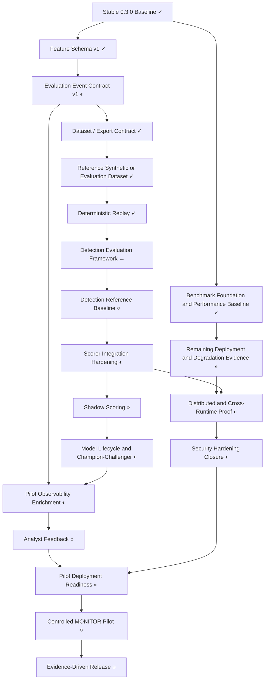

# AI-Sentinel Engineering Roadmap Canvas

This canvas is the short visual companion to the authoritative tracker:
`docs/planning/ENGINEERING_ROADMAP_TRACKER.md`.

If the tracker and canvas disagree, the tracker wins.

## Current Position

- Stable baseline: `0.3.0`
- Core runtime: framework-independent Java decision core plus Spring Boot / Servlet adapter
- Additional runtime paths: Java remote evaluation and ASP.NET Core reference adapter
- Current safety posture: default `MONITOR`
- Current contract baseline:
  - feature schema v1
  - evaluation event contract v1
  - remote evaluation contract v1
- Current benchmark baseline:
  - JMH benchmark foundation complete
  - accepted in-process reference performance baseline tracked
  - resource measurement and benchmark comparison tooling complete
- Current maturity boundary:
  - dataset/export, reference dataset, and deterministic replay are in place
  - next work is detection evaluation, official detection baseline, and candidate-model/pilot rails

## Roadmap At A Glance

| Area | Capability | Status | Next Action |
|---|---|---|---|
| Runtime safety | Stable `0.3.0` baseline and MONITOR-safe runtime | ✓ DONE | Preserve as the engineering baseline |
| Runtime architecture | Framework-independent core, starter integration, scorer baseline, remote runtime | ✓ DONE | Keep compatibility and safety invariants intact |
| Benchmarks | Benchmark foundation, reference performance baseline, resource metrics, comparison tooling | ✓ DONE | Use as evidence for future changes |
| Feature contract | Versioned feature schema v1 | ✓ DONE | Preserve as the current feature contract |
| Evaluation event contract | Versioned evaluation event contract v1 | ◐ PARTIAL | Connect it to production emission and broader evidence flows |
| Dataset contract | Dataset / export contract and privacy policy | ✓ DONE | Preserve the accepted export boundary and privacy rules |
| Reference data | Reference synthetic / evaluation dataset | ✓ DONE | Preserve deterministic generation, annotations, and privacy guarantees |
| Replay | Deterministic replay platform | ✓ DONE | Preserve replay determinism and configuration provenance |
| Detection evaluation | Detection evaluation framework | → NEXT | Add reusable metrics and reports beyond scenario tests |
| Detection baseline | Official detection reference baseline | ○ PLANNED | Establish a tracked quality baseline distinct from performance |
| Scorer lifecycle | Scorer plug-in / candidate-model integration hardening | ◐ PARTIAL | Add descriptor, schema support, health, and lifecycle rules |
| Shadow scoring | Non-authoritative candidate scoring | ○ PLANNED | Add observational-only dual scoring with disagreement capture |
| Model governance | Model lifecycle and champion/challenger | ◐ PARTIAL / ○ PLANNED | Harden registry governance, then compare champion vs challenger |
| Pilot readiness | Pilot observability / analyst feedback / deployment readiness | ◐ PARTIAL | Turn generic telemetry into pilot evidence flows |
| Pilot | Controlled MONITOR pilot | ○ PLANNED | Run only after evidence and reliability prerequisites exist |
| Release planning | Evidence-driven next release | ○ PLANNED | Scope release from evidence, not roadmap optimism |

## Visual Dependency Flow

## Findings That Affect Ordering

| Finding | Status | Why It Matters | Planned Timing |
|---|---|---|---|
| `FIND-001` Cross-runtime sensitive-header mapping mismatch | RESOLVED | Java now uses an explicit safe-header allowlist with `Authorization` presence-only transport, so dataset/export privacy no longer sits on a copy-all header bridge | Keep the resolved evidence in the tracker; do not regress the privacy boundary |
| `FIND-002` Reference baseline `analysis.json` consistency gap | OPEN | Benchmark auditability/docs should match the actual capture process | Resolve as a narrow benchmark evidence consistency task |

## Immediate Engineering Queue

1. Detection evaluation framework
2. Official detection reference baseline
3. Scorer plug-in / candidate-model integration hardening
4. Shadow scoring
5. Remaining deployment/degradation evidence
6. Model lifecycle and champion/challenger
7. Pilot observability, analyst feedback, and deployment readiness

## Synchronization Rule

- The tracker is the source of truth.
- Every future planning or implementation task must update the tracker first.
- Then update this canvas so the status, queue, and findings remain aligned.
